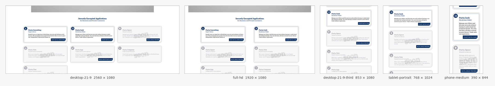

# Webdesign Scanner

**Responsive Design — Tested and Approved by AI Agent**

Renders PNG and PDF of your website in many sizes on many resolutions, so that you and your AI coding agent can easily verify the proper fit of your design on all devices.



```bash
$ docker run --name scan -e TARGET_URL=https://example.com mwaeckerlin/webdesign-scanner
$ docker cp scan:/out ./out && docker rm scan
```

[Quick start](#quick-start) ·
[Design check in your AI agent](#the-design-check-in-your-ai-agent) ·
[Pages behind a login](#pages-behind-a-login-the-workflow-format) ·
[Prompts for a manual review](#analysing-the-images-by-hand) ·
[Configuration](#configuration)

---

# What it can do

A screenshot tool captures one window. This captures:

- **26 viewports**, including the half, third and two-third widths of a
  monitor.
- **Every scroll position**, plus a separate series for each panel that
  scrolls on its own.
- **Pages behind a login**, reached by a declarative workflow file;
  passwords come from the environment or a secret file.
- **The right page, or nothing.** The workflow ends with checks; if one
  fails, the run stops and throws every image away.
- **A3, A4, A5, Letter** upright and sideways as PDF, every page also as PNG.
- **A manifest** that says for every file which viewport, scroll position and
  panel it shows.

## Output of one run

```text
out/
  screen/hd-1280x720-viewport-000-x00000y00000.png
         hd-1280x720-scroll-001-x00000y00648.png
         hd-1280x720-fullpage-000-x00000y00000.png
         hd-1280x720-region-000-x00000y00000-r01-main-x00000y00420.png
  print/pdf/a4-portrait.pdf
        png/a4-portrait-p001.png
  meta/manifest.json    what every file shows
       summary.md       the same in words
```

---

# Using it

## Quick start

Run the container, then copy the results out of it:

```bash
$ docker run --name scan -e TARGET_URL=https://example.com mwaeckerlin/webdesign-scanner
$ docker cp scan:/out ./out && docker rm scan
```

Nothing of yours is mounted into the container, so a run cannot touch your
working copy. `docker cp` writes the files as you, so they belong to you.

That is the full catalogue — 26 viewports and four paper formats upright and
sideways. It takes about five minutes and produces several hundred images.
For a first look add:

```bash
      -e VIEWPORTS=full-hd,phone-medium -e PRINT=false
```

From a clone, the same through Compose:

```bash
$ git clone https://github.com/mwaeckerlin/webdesign-scanner.git
$ cd webdesign-scanner
$ TARGET_URL=https://example.com npm start
$ npm run results        # copies the results to ./out
$ npm stop               # removes container and volume
```

## Getting the results out

The results stay inside the container, or inside a volume when you use
Compose. Copy them out:

```bash
$ docker cp scan:/out ./out                       # from the named container
$ npm run results                                 # docker compose cp, into ./out
$ docker compose cp scanner:/out ./somewhere      # the same, explicitly
```

**Or mount a directory** and skip the copy — one command instead of three:

```bash
$ mkdir -p out
$ docker run --rm -u $(id -u):$(id -g) -e TARGET_URL=https://example.com \
      -v "$PWD/out:/out" mwaeckerlin/webdesign-scanner
```

### Why the copy is the default

**Security.** The browser renders whatever the target site serves, which is
untrusted code. A mount is a writable hole from that browser into your file
system: if the page ever escapes the browser, it writes where the mount
points. Without a mount there is nothing outside the container to reach, and
the damage ends when the container is removed. This is the reason the shipped
skill for AI agents never mounts — an agent runs the scanner unattended,
against whatever url it was handed.

**Ownership.** A mounted directory is written by the container user, so the
files end up belonging to somebody else unless you pass
`-u $(id -u):$(id -g)`. And the directory has to exist first: Docker
otherwise creates it as root and the run cannot write into it. `docker cp`
writes through the Docker client as you, so neither question arises.

**Speed off Linux.** On macOS and Windows a mount goes through a file sharing
layer. For several hundred images that is slow; a copy transfers in one go.

The mount pays off when you run the scanner yourself, on your own machine,
against a site you trust, and want the images without a second command. That
is a fair trade — make it knowingly.

## Reaching the target url

**A public site.** Nothing to do.

**A service in the same Compose stack.** Inside a Compose network the
service name is the host name, and the port is the container port, not a
published one.

```yaml
services:
  app:
    image: my/app
  scanner:
    image: mwaeckerlin/webdesign-scanner
    depends_on: [app]
    environment:
      TARGET_URL: http://app:8080/
    volumes:
      - out:/out
```

**Something running on the Docker host.** `localhost` inside the container
is the container itself. Use `host.docker.internal`, which needs an extra
host entry on Linux:

```yaml
services:
  scanner:
    image: mwaeckerlin/webdesign-scanner
    extra_hosts:
      - "host.docker.internal:host-gateway"
    environment:
      TARGET_URL: http://host.docker.internal:3000/
```

**Something on the host that only answers to its own domain.** Many
applications refuse a request whose `Host` header is not a configured,
trusted name — Nextcloud's `trusted_domains`, Django's `ALLOWED_HOSTS`, a
Rails host authorisation. Reached through `host.docker.internal` they see
that name in the `Host` header and answer with an error page, and the scan
captures the error page instead of the site. Share the host's network
instead, so the container reaches the published port under the exact name
the app trusts:

```yaml
services:
  scanner:
    image: mwaeckerlin/webdesign-scanner
    network_mode: host
    environment:
      # the port the app publishes on the host; localhost is now the host
      TARGET_URL: http://localhost:29824/
```

`network_mode: host` is Linux-only; on it a port published on the host is
reachable at `localhost:<published-port>`, with the `Host` header the app
expects. On Docker Desktop, where host networking is limited, add
`host.docker.internal` to the app's trusted-domain list instead and keep the
recipe above. A full, working stack for this case — a running app behind a
login, scanned over the host network — is in
[examples/host-login/](examples/host-login/). It asks you to create a
password file for a throw-away review account; that file is covered by
`.gitignore` and a test keeps it covered.

`network_mode: host` gives the container the host's network stack, so it
reaches every port on that machine, not only the one you meant. Use it for a
local development stack you control, and keep it out of anything that scans a
site you do not.

For a site with a self-signed certificate add `browser.ignoreHttpsErrors:
true`; for a staging environment behind a header token use
`browser.extraHeaders`.

## The design check in your AI agent

Whenever a change touches something visible, your agent renders the page,
looks at the images and fixes what it finds — before you commit. Three files
set that up, ready to copy from [examples/.claude/](examples/.claude/).

**1. The skill:**

```bash
cp -r examples/.claude/skills/design-test ~/.claude/skills/
```

**2. The rule** — this paragraph into your `~/.claude/CLAUDE.md`. It is what
makes the agent apply the skill on its own instead of waiting to be asked:

```markdown
Before every commit that touches something with a visible surface — markup,
CSS, template, component, layout, font, colour, text, image, print style —
and at the end of every design-relevant feature or bugfix, run the skill
`design-test`. In doubt, run it. A passing test suite is never a substitute:
it says nothing about how the page looks. Findings from that run are fixed
and re-rendered, never listed. A finding that needs a design decision is
named as a blocker, with the image that shows it.
```

**3. The permissions** — into `permissions.allow` of your
`~/.claude/settings.json`, so a run never stops to ask:

```json
"Bash(docker run:*)", "Bash(docker cp:*)", "Bash(docker rm:*)", "Bash(docker compose:*)"
```

`Bash(docker run:*)` allows **any** container, including one as root with any
mount. Narrow it to
`Bash(docker run --rm -u * mwaeckerlin/webdesign-scanner*)` where that
matters, and accept that a changed argument order then asks again.

For one project instead of all, put the same three files in
`<project>/.claude/`.

### How it works

```text
you: "fix the header spacing"
 ├─ agent edits the CSS
 ├─ CLAUDE.md is in context      → visible surface touched → check due
 ├─ skill descriptions are in context → design-test matches → body loaded
 ├─ agent runs the container     (allowed, no prompt) → images in out/
 ├─ agent OPENS the PNGs         → the model sees the pixels
 ├─ compares each against the checklist it just loaded
 └─ finding → fix → render again → look again → commit
```

- **`CLAUDE.md`** is read on every request; that is what makes the check
  mandatory. One paragraph, no procedure — every line there costs context
  forever.
- **The skill** is loaded only when its `description` matches the situation.
  Hence the description names the **trigger**, not the capability: one that
  says what the skill *does* is never matched, and the skill stays unused.
- **The permissions** keep the run from stopping mid-task to ask.
- **The agent opens the PNGs.** The file tool passes them to the model as
  images, so it sees the rendered pixels and compares them against the
  checklist. If it cannot read the images it falls back to summarising
  `manifest.json`, and then it reports nothing it has actually seen.

---

# Configuration and operation

## Configuration

Three sources, each one overriding the one before: the built-in defaults,
then the configuration file, then the environment variables. The manifest
records the settings the run actually used, so any run can be repeated.

An unknown option is an error, never an ignored line. A misspelled option
that is quietly dropped produces a run that looks fine and captures the
wrong thing.

### Environment variables

These are the settings that change from run to run:

| Variable | Meaning |
| --- | --- |
| `TARGET_URL` | the entry url; required unless the configuration file has `url` |
| `CONFIG_FILE` | path to a YAML or JSON configuration file inside the container |
| `WORKFLOW_FILE` | path to a workflow file inside the container |
| `STORAGE_STATE` | path to an existing Playwright storage state to start from |
| `STORAGE_STATE_OUT` | where to write the authenticated state after the run |
| `OUT_DIR` | output directory, default `/out` |
| `ON_EXISTING` | `fail` (default) or `overwrite` |
| `LOG_LEVEL` | `debug`, `info` (default), `warn` or `error` |
| `VIEWPORTS` | comma separated list of viewport names |
| `DERIVED_VIEWPORTS` | `false` switches the part widths off |
| `SCREENSHOTS` | `false` switches all screenshots off |
| `PRINT` | `false` switches the print output off |
| `PRINT_FORMATS` | comma separated paper formats |
| `PRINT_ORIENTATIONS` | `portrait`, `landscape` or both |
| `SETTLE_MS` | extra wait before capturing, in milliseconds |
| `NAVIGATION_TIMEOUT` | navigation timeout in milliseconds |
| `CHROMIUM_SANDBOX` | `true` adds the browser sandbox on top of the container (see below) |

### Configuration file

[`examples/config.yaml`](examples/config.yaml) contains every option at its
default value, with a comment on each. It is validated by a test, so it can
never drift away from the real defaults. Copy it, delete everything you do
not change, and point `CONFIG_FILE` at it.

Nothing is mounted from the host, so the file has to be inside the image.
Build a small image of your own on top of this one —
[`examples/with-files/`](examples/with-files/) is a complete, working
example:

```dockerfile
FROM mwaeckerlin/webdesign-scanner
USER root
COPY config.yaml workflow.yaml /etc/webdesign-scanner/
RUN ${ALLOW_USER} /etc/webdesign-scanner
USER ${RUN_USER}
ENV CONFIG_FILE="/etc/webdesign-scanner/config.yaml"
ENV WORKFLOW_FILE="/etc/webdesign-scanner/workflow.yaml"
```

## Viewports

### The catalogue

| Name | CSS pixels | Kind | Density | What it stands for |
| --- | --- | --- | --- | --- |
| `desktop-4-3` | 1024 × 768 | desktop | 1× | classic 4:3 desktop |
| `hd` | 1280 × 720 | desktop | 1× | HD / 720p, 16:9 |
| `desktop-16-10` | 1440 × 900 | desktop | 1× | 16:10 notebook |
| `desktop-16-9` | 1600 × 900 | desktop | 1× | 16:9 desktop |
| `full-hd` | 1920 × 1080 | desktop | 1× | Full HD / 1080p |
| `desktop-21-9-fhd` | 2560 × 1080 | desktop | 1× | 21:9 ultrawide, entry size |
| `desktop-21-9` | 3440 × 1440 | desktop | 1× | 21:9 ultrawide, the common size |
| `uhd` | 3840 × 2160 | desktop | 1× | UHD / 4K |
| `tablet-portrait` | 768 × 1024 | tablet | 2× | tablet upright |
| `tablet-landscape` | 1024 × 768 | tablet | 2× | tablet sideways |
| `phone-small` | 360 × 640 | phone | 2× | small phone, upright |
| `phone-medium` | 390 × 844 | phone | 2× | common phone, upright |
| `phone-large` | 430 × 932 | phone | 2× | large phone, upright |
| `phone-landscape` | 844 × 390 | phone | 2× | common phone, sideways |

Tablets and phones are emulated with touch input; phones additionally with
mobile emulation. `desktop-4-3` and `tablet-landscape` share their
dimensions but are both kept: pixel density and touch make them render
differently.

Own viewports go into `viewports.custom`:

```yaml
viewports:
  presets: [full-hd, phone-medium]
  custom:
    - name: kiosk
      width: 1080
      height: 1920
      kind: desktop
      deviceScaleFactor: 1
```

### Derived part widths

Every desktop viewport is additionally captured at **half its width and the
same height**. An ultrawide viewport — aspect ratio 2:1 or wider —
additionally at **one third** and **two thirds**. That is a browser window
sharing a monitor with something else, and it is where responsive layouts
break first.

| Base | Derived |
| --- | --- |
| `full-hd` 1920 × 1080 | `full-hd-half` 960 × 1080 |
| `desktop-21-9-fhd` 2560 × 1080 | `desktop-21-9-fhd-third` 853 × 1080, `desktop-21-9-fhd-half` 1280 × 1080, `desktop-21-9-fhd-two-thirds` 1706 × 1080 |
| `desktop-21-9` 3440 × 1440 | `desktop-21-9-third` 1146 × 1440, `desktop-21-9-half` 1720 × 1440, `desktop-21-9-two-thirds` 2293 × 1440 |

Widths are rounded down. A derived width below `minDerivedWidth` (320) is
dropped with a note — it would not be a realistic window. Tablets and phones
get no part widths. Switch the whole mechanism off with
`viewports.derived: false` or `DERIVED_VIEWPORTS=false`.

Two entries that would render identically — same width, height, pixel
density, touch and mobile emulation — are merged. The first one keeps its
name, the other is recorded as its alias in the manifest.

### These are CSS pixels, not window sizes

Every number is the **CSS viewport**: the area the page lays itself out in.
It is *not* the outer size of a browser window, which additionally carries
the tab strip, the address bar, the bookmark bar and possibly a scrollbar.
On a real 1920 × 1080 monitor with a maximised browser, the page sees
roughly 1920 × 900. If you want to reproduce what a user with a specific
setup sees, add a custom viewport with the height you measured.

## Screenshots

Four kinds of image are produced per viewport, all into `/out/screen/`:

1. **`viewport`** — what a visitor sees the moment the page is ready, after
   loading and after the optional workflow. The first impression.
2. **`scroll`** — a series over every scroll position of the main document.
3. **`fullpage`** — one image of the whole document, where the browser can
   produce it.
4. **`region`** — one series per independently scrollable inner area.

### How a scroll series is laid out

The series starts at the origin and advances by the visible size minus a
configurable overlap (`screenshots.overlap`, default 10 %), so nothing falls
between two images. The **exact end position is always included**, even when
it is closer than one step; the bottom of a page decides as much as the top.
Duplicate positions are removed.

Where the document also scrolls sideways, both axes are combined: every
horizontal position at every vertical position. Both axes belong to the same
box, so their combination shows content that neither axis alone shows.

Content that loads while scrolling extends the series: after every step the
document is measured again, and if it grew, the remaining positions are laid
out anew and still end at the new bottom. In addition, the whole document is
scrolled through once before the series starts (`stabilize.preScroll`), so
lazily loaded content exists before anything is measured.

### Inner scroll areas

An element counts as an independently scrollable area when its computed
overflow allows scrolling **and** there is more content than fits **and** it
is actually rendered and big enough (`regions.minWidth` / `minHeight`, 120 ×
120 by default). An `overflow: auto` box whose content fits is not an area —
it would only produce duplicates of the main document.

Each area is captured **on its own**: the others stay at the offset they had
when they were found, and only this one is scrolled through its positions.
The positions of independent areas are **never combined**. Three areas with
five positions each produce fifteen images, not one hundred and twenty-five,
and the fifteen show everything the hundred and twenty-five would.

Nested areas are followed as well, up to `regions.maxDepth` levels. Each
image is clipped to its area, and the manifest and the file name record
where the main document stood while it was taken.

A full page image only ever covers the main document. Whatever is hidden
inside an inner area is covered by that area's own series — this is exactly
why they exist.

### Safety limits

The defaults are generous and every limit can be changed. **Whenever a limit
applies, the log, the manifest and the summary say so**, with what was wanted
and what was captured. An incomplete capture must never look complete.

| Limit | Default | Bounds |
| --- | --- | --- |
| `screenshots.maxStepsPerAxis` | 200 | positions per axis of one box |
| `screenshots.maxShotsPerViewport` | 1000 | images per viewport |
| `screenshots.maxShotsTotal` | 10000 | images of the whole run |
| `screenshots.fullPageMaxHeight` | 30000 | document height still worth one full page image |
| `screenshots.regions.maxRegions` | 25 | inner areas per viewport, largest first |
| `screenshots.regions.maxDepth` | 4 | nesting levels of inner areas |
| `screenshots.regions.maxShotsPerRegion` | 200 | images per inner area |

### File names

```text
<viewport>-<width>x<height>-<capture>-<sequence>-x<scrollX>y<scrollY>.png
<viewport>-<width>x<height>-region-<sequence>-x<scrollX>y<scrollY>-<area>-main-x<mainX>y<mainY>.png
```

```text
full-hd-1920x1080-viewport-000-x00000y00000.png    the first impression
full-hd-1920x1080-scroll-004-x00000y03888.png      fifth image of the series, 3888 px down
full-hd-1920x1080-fullpage-000-x00000y00000.png    the whole document
full-hd-1920x1080-region-002-x00000y00480-r03-main-x00000y01200.png
```

The last one: third image of inner area `r03`, that area scrolled 480 px
down, taken while the main document stood 1200 px down. Which element `r03`
is — its selector and its accessible label — is in the manifest.

## Print output

The browser print function produces one PDF per paper format and
orientation, and every PDF page is additionally rendered as a PNG with
`pdftoppm`.

```text
/out/print/pdf/a4-portrait.pdf
/out/print/png/a4-portrait-p001.png
/out/print/png/a4-portrait-p002.png
```

| Option | Default | Meaning |
| --- | --- | --- |
| `print.formats` | `A3, A4, A5, Letter` | any of A0…A6, Letter, Legal, Tabloid, Ledger |
| `print.orientations` | `portrait, landscape` | |
| `print.margin` | `10mm` on each side | any CSS length |
| `print.printBackground` | `true` | without it most designs print white |
| `print.preferCSSPageSize` | `false` | see below |
| `print.scale` | `1` | 0.1 … 2 |
| `print.viewport` | `full-hd` if configured, else the first | the viewport whose state is printed |
| `print.png.dpi` | `150` | resolution of the rendered page images |

**Which paper size wins.** With `preferCSSPageSize: false` — the default —
the formats configured here decide, and a `@page { size: … }` rule in the
document is ignored. Each configured format then produces its own PDF, which
is what you want when you are reviewing how a design behaves on different
paper. With `preferCSSPageSize: true` the document decides: a page that
declares `@page { size: A5 landscape }` is printed on A5 landscape whatever
you configured, and the configured formats only apply where the document
says nothing. Use that when you are reviewing a document whose paper size is
part of its design.

Print stylesheets (`@media print`), page breaks, background graphics,
margins and scaling are all applied — the PDF is what a reader would get
from the browser's print dialog.

## Loading and stabilisation

Before anything is captured the page is brought into a reproducible state,
otherwise a before/after comparison measures noise instead of design.

| Option | Default | What it does |
| --- | --- | --- |
| `navigation.waitUntil` | `load` | how long navigation is waited for |
| `navigation.failOnErrorStatus` | `true` | an entry url answering 400 or worse stops the run |
| `stabilize.fonts` | `true` | wait for webfonts — a fallback font changes every line break |
| `stabilize.networkIdle` | `true` | wait for the network to go quiet |
| `stabilize.networkIdleTimeout` | `10000` | a page with a websocket never goes quiet; after this the run continues and records a warning |
| `stabilize.settleMs` | `1000` | extra wait for content that arrives late |
| `stabilize.scrollSettleMs` | `400` | wait after every scroll step |
| `stabilize.freezeAnimations` | `true` | stop animations and transitions |
| `stabilize.hideCaret` | `true` | hide the blinking text caret |
| `stabilize.preScroll` | `true` | scroll through the document once to trigger lazy loading |

Navigation errors, uncaught JavaScript errors, failed requests and console
errors are recorded in the manifest. With `diagnostics.failOnPageError` or
`diagnostics.failOnHttpError` either kind can be turned into a failed run —
useful in a pipeline, where a broken page should not be reviewed at all.

## Output structure

```text
/out/
  screen/                png images of every captured state
  print/pdf/             one pdf per paper format and orientation
  print/png/             every pdf page as an image
  meta/manifest.json     what every file shows
  meta/summary.md        the same in words
  debug/                 only after a failure: the state at that moment
```

`meta/manifest.json` exists **only after a successful run**. A failed run
writes `meta/error.json` instead. That is deliberate: the presence of a
manifest is the promise that the capture is complete.

## The manifest

```json
{
  "manifestVersion": 1,
  "tool": { "name": "@mwaeckerlin/webdesign-scanner", "version": "1.0.1" },
  "run": { "status": "ok", "startedAt": "…", "finishedAt": "…", "durationMs": 42000,
           "browserSandbox": false },
  "target": { "requestedUrl": "…", "finalUrl": "…", "title": "Dashboard" },
  "config": { "…": "the complete effective configuration" },
  "workflow": {
    "file": "…", "name": "login", "status": "completed",
    "runs": [ { "viewport": "full-hd", "status": "completed", "steps": [ … ] } ]
  },
  "viewports": [
    { "name": "full-hd-half", "width": 960, "height": 1080, "deviceScaleFactor": 1,
      "kind": "desktop", "derivedFrom": "full-hd", "fraction": "1/2", "aliases": [] }
  ],
  "artifacts": [
    { "type": "screenshot", "capture": "scroll",
      "path": "screen/full-hd-1920x1080-scroll-004-x00000y03888.png",
      "viewport": "full-hd", "sequence": 4,
      "scroll": { "x": 0, "y": 3888 }, "mainScroll": null, "region": null,
      "image": { "width": 1920, "height": 1080, "bytes": 481234 } },
    { "type": "screenshot", "capture": "region",
      "path": "screen/full-hd-1920x1080-region-002-x00000y00480-r03-main-x00000y01200.png",
      "region": { "id": "r03", "label": "Conversation", "depth": 1,
                  "selector": "main > div:nth-of-type(2) > aside",
                  "scroll": { "x": 0, "y": 480 } },
      "mainScroll": { "x": 0, "y": 1200 } },
    { "type": "pdf", "path": "print/pdf/a4-portrait.pdf",
      "format": "A4", "orientation": "portrait", "pages": 3 },
    { "type": "pdf-page-image", "path": "print/png/a4-portrait-p001.png",
      "format": "A4", "orientation": "portrait", "page": 1, "dpi": 150,
      "image": { "width": 1240, "height": 1754, "bytes": 210344 } }
  ],
  "diagnostics": { "warnings": [], "limits": [], "pageEvents": [] }
}
```

Neither the manifest nor the summary ever contains a secret or an
authenticated browser state.

---

## Exit codes

| Code | Meaning |
| --- | --- |
| 0 | the capture is complete |
| 1 | an unexpected internal error |
| 2 | configuration or workflow file rejected |
| 3 | the output directory already holds results |
| 4 | a workflow step or a closing assertion failed |
| 5 | the target url could not be opened, or answered with an error status |
| 6 | rendering, the print toolchain or writing a file failed |
| 130 | stopped from outside, by ctrl-c or by the container being shut down |

Any code other than 0 means: no screenshot and no PDF was left behind.

An interrupted run is a category of its own on purpose. Ctrl-c kills the
browser, and whichever call was in flight rejects with a message about a
closed page — reported as an internal error, that would send you looking for
a defect that is not there. The run instead logs the signal it received,
writes `meta/error.json` with the category `aborted`, and heads its summary
`# Capture stopped`.

## Troubleshooting

**"the output directory already holds results"** — a previous run is still
in the volume. `npm stop` removes it, or set `ON_EXISTING=overwrite`.

**"answered http 404"** — the entry url is an error page. Fix the url, or
set `navigation.failOnErrorStatus: false` if you really want to capture it.

**A workflow step fails.** Look at `/out/debug/` — the screenshots show what
the browser saw at that moment. Then run with `LOG_LEVEL=debug`: every step
is logged with its result. The usual causes are an accessible name that
differs from the visible text, a step that runs before the page has settled
(put a `waitFor…` in front of it), and a step that only applies on the first
viewport (give it a `when`).

**The page looks unfinished in the images.** Raise `stabilize.settleMs`, and
`stabilize.scrollSettleMs` for content that appears while scrolling.

**The run says the page still had background requests.** A websocket or a
polling request never lets the network go quiet. That is a warning, not an
error; the capture happened anyway. Lower `stabilize.networkIdleTimeout` to
stop waiting earlier.

**`requestfailed … net::ERR_ABORTED`.** The browser cancelled that request
itself; nothing failed on the network or on the server. Every page with a
`<video>` produces a handful of them, because a film that is never played is
fetched in pieces and abandoned. The address on the log line says which file
it was:

```
[warn] requestfailed [full-hd]: net::ERR_ABORTED — https://example.com/movies/hero.mp4
```

A cancelled film also means the images show the poster or the fallback
instead of a moving picture — which is what a design review wants anyway,
since animations are frozen on purpose. A request that really failed appears
as `httperror` with its status, or with a network code such as
`net::ERR_NAME_NOT_RESOLVED`.

**The run takes minutes.** The defaults are fourteen viewports plus the part
widths derived from them, twenty-six in all, and each one loads the page
again and scrolls through it. A normal site takes four to five minutes. Name
the viewports you want and it drops to seconds:

```bash
$ docker run --name scan -e TARGET_URL=https://example.com \
      -e VIEWPORTS=full-hd,tablet-portrait,phone-medium \
      -e PRINT_FORMATS=A4 -e PRINT_ORIENTATIONS=portrait \
      mwaeckerlin/webdesign-scanner
```

Where the time goes is visible in the log: every viewport reports how many
images it produced. A page whose content scrolls inside an inner area rather
than in the document itself spends nearly all of it in that one series.

**No full page image was produced.** The document is taller than
`screenshots.fullPageMaxHeight`, or the browser refused. The scroll series
covers the page either way; the manifest says which of the two it was.

**"the browser sandbox was requested but this host cannot provide it"** —
you set `CHROMIUM_SANDBOX=true` on a host whose AppArmor policy forbids
unprivileged user namespaces (Ubuntu 23.10 and newer do by default). Either
allow them on the host, or leave the setting at its default and rely on the
container as the isolation boundary — see the trade-off below.

**Chromium crashes on large viewports.** Shared memory is too small. The
supplied Compose file sets `shm_size: 1gb`; keep that when you write your
own.

## Security trade-offs

- **The container is the isolation boundary, not the browser sandbox.** The
  browser renders whatever the target site serves, which is untrusted code.
  Chromium can wrap that in a sandbox of its own — a second layer on top of
  the container — but a current Linux (Ubuntu 23.10 and newer) restricts
  unprivileged user namespaces through AppArmor, and then Chromium finds no
  usable sandbox inside a container and refuses to start at all. The default
  is therefore `browser.sandbox: false`, the same default Playwright itself
  uses. What still protects the host: the container runs as an unprivileged
  user, mounts nothing from the host, serves no port, and exits when the
  capture is done.
  Set `CHROMIUM_SANDBOX=true` to add the second layer where the host can
  deliver it — on a host that cannot, the run stops immediately with a
  message saying exactly that, instead of quietly running unsandboxed. Every
  manifest records which of the two it was, under `run.browserSandbox`, and
  the summary states it in words.
- **`browser.ignoreHttpsErrors` disables certificate verification.** It is
  meant for a test system with a self-signed certificate. On anything
  reachable from the internet it turns the run into an unauthenticated
  fetch.
- **The output is meant to be shared.** That is why the manifest is masked,
  why an authenticated storage state may not be written into the output
  directory, and why `debug/` is separate. Before you hand a result
  directory to anyone, remember that the screenshots show whatever was on
  screen — including real customer data if you scanned a production system
  with a real account.
- **Nothing is mounted from the host.** Configuration and workflow files are
  copied into an image, results leave through `docker cp`. A run cannot read
  or write anywhere in your working copy. Mounting a directory for the
  results is possible and documented, and it opens exactly one writable path
  from an untrusted page into your file system — see
  [why the copy is the default](#why-the-copy-is-the-default).

---

# Analysing the images by hand

Five ready-made prompts for a review you drive yourself: context template,
full analysis, single screenshot, consolidating two independent analyses,
before and after.

## What context is needed, and why

Visual consistency can be judged from the images alone: alignment, spacing,
hierarchy, contrast, whether the same element looks the same everywhere,
whether the layout survives at 360 pixels and on paper.

**Effectiveness cannot.** Whether a page works is a question about someone
doing something. Without the audience, the task, the main action and the
intended order of attention, a model can only tell you that a page looks
tidy — and a tidy page that puts the wrong thing first is worse than an
untidy one that puts the right thing first. Any confident statement about
effectiveness without that context is a guess dressed as a finding.

So give it:

| Context | Why it changes the answer |
| --- | --- |
| Purpose of the page or document | a landing page and a documentation page fail in opposite ways |
| Audience | who they are, how much they already know |
| Level of expertise | an expert wants density, a novice wants guidance |
| The user's primary task | what they came to do |
| The desired main action | the one thing that should happen |
| The intended order of attention | first, second, third — this is the core of the review |
| Desired style | professional, technical, elegant, casual … |
| Styles explicitly unwanted | often more informative than the desired one |
| Brand values and design rules | colours, fonts, spacing, components that are set |
| Language and cultural context | reading direction, formality, conventions |
| Expected devices | where the weight of the judgement belongs |
| What must not change | technical, legal or political constraints |
| Known problems | so the answer is not a list of things you know |
| Reference designs or competitors | the standard you are measured against |
| Requirements for the printed output | whether print matters at all, and what for |

## 1. Context template

Fill this in and put it in front of every prompt below.

```markdown
## Context

- **Purpose of the page:**
- **Audience:**
- **Level of expertise of the audience:**
- **Primary task of the user:**
- **Desired main action (conversion):**
- **Intended order of attention:** 1. … 2. … 3. …
- **Desired style:**
- **Explicitly unwanted style:**
- **Brand values and design rules:**
- **Language and cultural context:**
- **Expected devices (and their share):**
- **Must not change:**
- **Known problems:**
- **Reference designs or competitors:**
- **Requirements for the printed output:**
- **What this review is for:** (a decision, a redesign, a check before release …)
```

Leave a line blank rather than inventing an answer, and say so: an admitted
gap gets you a hedged finding, an invented one gets you a confident wrong
finding.

## 2. The full analysis prompt

Attach the images and `meta/manifest.json`, then:

```markdown
You are reviewing the design of a website from rendered evidence.

## Material

- Rendered screenshots of the page in several viewports, produced by a real
  browser. The file name of each image states the viewport, its dimensions
  in css pixels, the capture type (viewport = first impression, scroll =
  one position of a scroll series, fullpage = the whole document, region =
  an independently scrollable inner area), the sequence number and the
  scroll position.
- Rendered images of every printed page.
- `manifest.json`, which maps every file to the state it shows.

## How to work

1. Use the rendered images as your primary visual evidence. Do not infer
   what the page looks like from anything else.
2. Use the manifest and the file names when you refer to something. Every
   statement about a specific place names the file and where in that image
   it is.
3. Review desktop, tablet, mobile and print separately. Do not average them
   into one verdict; a design can be excellent on one and broken on another.
4. Judge these five dimensions separately, and say which evidence each
   judgement rests on:
   - **Aesthetics** — colour, typography, spacing, balance, coherence.
   - **Ergonomics** — readability, target sizes, form usability, reachability,
     line length, contrast.
   - **Hierarchy** — what is visually first, second, third, and whether the
     structure is legible.
   - **Attention** — where the eye is likely to go and in what order.
   - **Effectiveness** — whether the page serves the stated task and main
     action for the stated audience.
5. Separate strictly, and label each sentence accordingly:
   - **Observation** — what is visible in a named file.
   - **Interpretation** — what you conclude from it.
   - **Recommendation** — what to change.
6. Mark uncertainty explicitly. Where the material does not let you decide,
   say so instead of guessing, and say what additional material would settle
   it.
7. Be concrete. "Improve the visual hierarchy" is not a finding. "The
   headline and the primary button carry the same weight in
   full-hd-…-viewport-000; give the button the only saturated colour on the
   screen" is.
8. Name the strengths that must survive a redesign, not only the problems.
9. Prioritise by impact on the stated main action and by urgency.
10. Compare the intended order of attention from the context with the order
    you expect the design to produce, and explain each divergence.
11. Name the states you could not assess because they are not in the
    material.
12. For every important finding, propose how it could be verified.

## What to deliver

1. **Overall judgement** — at most five sentences.
2. **Order of attention** — a table: intended (from the context) against
   expected (from the design), per viewport class, with the divergence
   named.
3. **Findings**, as a table sorted by priority:

   | # | Finding | Evidence (file + place) | Dimension | Severity | Confidence | Expected impact | Recommendation | How to verify |

   Severity: blocker / high / medium / low. Confidence: high / medium / low,
   and low is a legitimate answer.
4. **Strengths to keep** — what is already working.
5. **The three most important next steps**, in the order you would do them.
6. **Open questions and what could not be assessed** — including which
   states were missing from the material.

## Limits you must respect

- Screenshots do not prove keyboard operability or screen reader support.
  Do not claim anything about either.
- Hover, focus, loading, error, empty and dialog states are not in the
  material unless a file shows them. Do not judge them.
- Any statement about where attention goes is a prediction from design
  principles, not eye tracking.
- Any statement about conversion is a hypothesis, not a measurement. Phrase
  it as one.
```

## 3. A single screenshot or component

For a quick look at one image, or at one component you cropped out:

```markdown
Review this one rendered image against the context below.

[context]

Give me, in this order:
1. What I see: composition, hierarchy, spacing, colour, typography — as
   observations, without judgement.
2. The order in which the eye is likely to move through it, and why.
3. The three strongest problems, each with the place in the image, its
   severity and your confidence.
4. What is already working and must not be lost.
5. What you cannot judge from this single image.

Be concrete: name the element, the place and the change. Separate
observation, interpretation and recommendation. Say when you are unsure.
```

## 4. Consolidating two independent analyses

Run the full prompt with ChatGPT and with Claude separately, on the same
material, without showing either one the other's answer. Then give both
answers to one of them:

```markdown
Here are two independent design analyses of the same material, made without
knowledge of each other, plus the context both of them had.

[context]

--- Analysis A ---
[paste]

--- Analysis B ---
[paste]

Consolidate them:

1. **Agreement** — findings both reached. Treat these as the most reliable,
   and say for each whether the evidence really supports it.
2. **Only in one** — findings only one of them made. For each: is it
   supported by the evidence, was it missed by the other, or is it an
   over-interpretation?
3. **Contradictions** — where they disagree. Name the disagreement, say what
   evidence would settle it, and give your own verdict with your confidence.
4. **A single prioritised list of findings**, in the format of the original
   analysis, with a column stating the source (A, B or both).
5. **Blind spots of both** — what neither of them looked at, and what in the
   material they did not use.

Do not smooth over a disagreement by averaging it. A contradiction between
two careful analyses is information: it marks the place where the evidence
is weak or the question is genuinely open.
```

## 5. Before and after

After making the changes, run the scanner again into a second output
directory and give both sets to the model:

```markdown
Two runs of the same page, before and after a redesign. The file names and
the manifests identify matching states: the same viewport, the same capture
type and the same sequence number show the same place.

[context]
[the findings that were meant to be fixed]

Give me:

1. **Per addressed finding**: fixed, partly fixed, not fixed, or made worse
   — with the before and after file for each, and what visibly changed.
2. **New problems introduced by the change**, with evidence.
3. **Regressions**: things that used to work and no longer do, particularly
   in viewports that were not the focus of the change.
4. **The order of attention before against after**, and whether it moved
   towards the intended one.
5. **A verdict**: is the design better for the stated task and audience? Say
   how confident you are and what the judgement rests on.
6. **What still has to change**, prioritised.

Compare only what the images actually show. Where a change cannot be seen in
the material, say so instead of assuming it happened.
```

## What such an analysis can and cannot show

Be clear about this with whoever receives the report:

- **Screenshots do not prove usability.** Keyboard operability, focus order
  and screen reader behaviour are invisible in an image. They need a browser,
  a keyboard and a screen reader.
- **States that were not captured cannot be judged.** Hover, focus, loading,
  error, empty and dialog states only exist in the material if a workflow
  produced them. Everything said about them is invention.
- **Predicted attention is not eye tracking.** It is a well-founded
  inference from contrast, size, position and reading direction — reliable
  enough to work with, and not a measurement.
- **Conversion effects are hypotheses.** No model can tell you what a change
  does to a conversion rate. It can tell you what to test.
- **Important conclusions must be validated**: with a browser test for
  behaviour, with user observation for comprehension, with analytics for
  actual paths, with an A/B test for effect, and with real eye tracking
  where attention itself is the question.
- **Two models, independently, are worth more than one.** Give ChatGPT and
  Claude the same material without showing either the other's answer, then
  consolidate. Where they agree, the finding is solid; where they disagree,
  you have found the place where the evidence is thin.

## Working with a lot of material

A thorough run produces hundreds of images. Do not upload all of them.

- **Pick representative viewports**: one large desktop, one half width, one
  tablet, one phone, plus the print pages. That is usually four to six
  images plus the first impression of each.
- **Keep a scroll series together.** The images of one series belong in one
  batch, in order — a series torn apart is unreadable, and the model will
  invent the connection.
- **One batch, one question.** Analyse desktop in one pass, mobile in the
  next, print in a third. A single pass over everything produces an average,
  and an average is exactly what a design review must not be.
- **Always include the manifest**, or at least the file names. Without them
  the model cannot tell a first impression from a scroll position, and the
  findings lose their addresses.
- **Inner areas last.** Review the page first, then the panels that scroll
  on their own, with the manifest entry saying which element each one is.

---

# Pages behind a login: the workflow format

The entry url is rarely the page worth reviewing. A workflow file describes
how to get there — declaratively, in YAML or JSON, versioned.

```bash
      -e WORKFLOW_FILE=/etc/webdesign-scanner/workflow.yaml
```

## A first workflow

```yaml
version: 1
name: open-the-dashboard

defaults:
  timeout: 15000

steps:
  - action: click
    label: accept cookies
    optional: true
    target:
      role: button
      name: Accept all

  - action: fill
    target:
      label: User name
    value:
      env: SCAN_USERNAME

  - action: fill
    target:
      label: Password
    value:
      file: /run/secrets/scan_password

  - action: click
    target:
      role: button
      name: Sign in

  - action: waitForUrl
    url: "**/app/**"

  - action: expectVisible
    target:
      role: heading
      name: Dashboard

  - action: ready
```

Two complete files to start from:
[`examples/workflow-login.yaml`](examples/workflow-login.yaml) and
[`examples/workflow-forms-frames-tabs.yaml`](examples/workflow-forms-frames-tabs.yaml),
which shows every action once.

## Actions

Every step is a mapping with an `action`. Common to all of them: `label` (a
name for the log and the manifest), `optional`, `when`, `timeout`, `frame`
and `page`.

| Action | Fields | Does |
| --- | --- | --- |
| `goto` | `url`, `waitUntil` | navigate; a relative url is resolved against the entry url |
| `click` | `target`, `button`, `clickCount`, `force` | click |
| `dblclick` | `target` | double click |
| `hover` | `target` | move the pointer onto an element |
| `fill` | `target`, `value` | set the content of a field at once |
| `type` | `target`, `value`, `delay` | type key by key, for fields that react to every keystroke |
| `press` | `key`, optional `target` | a key or a shortcut, with or without an element |
| `select` | `target`, one of `values`, `labels`, `indexes` | choose in a select |
| `check` / `uncheck` | `target` | tick and untick |
| `upload` | `target`, `files` | attach files that are inside the image |
| `scrollIntoView` | `target` | bring an element into view |
| `waitForSelector` | `target`, `state` | wait for `visible`, `hidden`, `attached` or `detached` |
| `waitForUrl` | `url`, `match` | wait until the address matches |
| `waitForLoadState` | `state` | wait for `load`, `domcontentloaded` or `networkidle` |
| `waitForTimeout` | `ms` | wait a fixed time — the last resort |
| `expectVisible` / `expectHidden` | `target` | assert |
| `expectText` | `target`, `text`, `match` | assert the text of an element |
| `expectCount` | `target`, `count` | assert how many elements match |
| `expectUrl` | `url`, `match` | assert the address |
| `expectTitle` | `text`, `match` | assert the page title |
| `expectPopup` | `name`, `trigger` | run the trigger step and catch the tab it opens |
| `usePage` | `name` | continue on another tab; `main` is the one the run started on |
| `closePage` | `name` | close a tab |
| `saveStorageState` | `path` | write the authenticated state to a file |
| `ready` | — | release the state for capture; must be the last step |

`match` is one of `exact`, `contains`, `glob` (default for urls) or `regex`.
In a glob, `*` stops at a path separator, `**` crosses it, `?` stands for one
character, and the whole pattern is anchored.

## Addressing an element

Prefer the robust forms — they survive a redesign, a CSS refactoring and a
change of class names:

```yaml
target:
  role: button          # the accessibility role
  name: Sign in         # its accessible name
  exact: true           # match the name exactly instead of loosely
```

| Key | Addresses by |
| --- | --- |
| `role` + `name` | accessibility role and accessible name — the first choice |
| `label` | the label of a form field |
| `placeholder` | the placeholder text |
| `text` | visible text |
| `testId` | a `data-testid` attribute |
| `altText` | the alternative text of an image |
| `title` | the title attribute |
| `css` | a CSS selector — the fallback for markup that offers nothing better |

Exactly one of them per target. Three refinements can be added: `hasText`
narrows to elements containing a text, `nth` picks one of several matches
(counting from zero), and `within` scopes the search to a surrounding
element:

```yaml
target:
  role: button
  name: Delete
  within:
    testId: row-7
```

## Values and secrets

A `value` is either a plain string, or a reference:

```yaml
value: literal text            # a plain value
value: { env: SCAN_PASSWORD }  # from an environment variable
value: { file: /run/secrets/scan_password }   # from a secret file
value: { literal: "env" }      # a plain value that looks like a reference
```

**A password never has to stand in the workflow file.** Everything that
comes from `env` or `file` is registered as a secret and masked as `***` in
every log line, in the manifest, in the summary and in every error message —
in its plain, url encoded, JSON encoded and base64 form, because that is how
a credential reappears in a request url or a serialized error. A missing
environment variable stops the run rather than sending an empty password and
locking the account.

For Docker secrets, `/run/secrets/<name>` is the path; a trailing newline is
stripped. [`examples/with-files/docker-compose.yml`](examples/with-files/docker-compose.yml)
shows the complete arrangement.

## Optional and conditional steps

A cookie banner is not always there, and on the second viewport the login
form is gone because the session is already established. Two mechanisms:

```yaml
- action: click
  optional: true            # failure is a warning, the run continues
  target: { role: button, name: Got it }

- action: fill
  when:                     # evaluated immediately, before the step runs
    visible: { label: Password }
  target: { label: Password }
  value: { env: SCAN_PASSWORD }
```

`when` takes `visible`, `hidden`, `urlMatches` or `not` with a nested
condition. It is checked immediately, without waiting — put a `waitFor…`
step in front of it when the page still has to settle. A condition that
cannot be evaluated at all, typically because the page is navigating away at
that moment, counts as **not met**: a workflow that branches after a click
must not depend on timing.

Prefer `when` over `optional`: a condition that is not met is a decision, a
failing optional step is an error that happens to be tolerated and costs the
full timeout.

## Frames, tabs and windows

```yaml
- action: fill
  frame: { css: "iframe#editor" }     # or { name: … } or { url: "**/embed*" }
  target: { role: textbox, name: Body }
  value: Text inside the frame

- action: expectPopup
  name: preview
  trigger:
    action: click
    target: { role: link, name: Open preview }

- action: expectTitle
  text: Preview        # runs on the new tab, which is now the active one

- action: closePage
  name: preview
- action: usePage
  name: main
```

## Releasing the state for capture

`ready` marks the point where the workflow is done and the state is the one
to capture. It must be the last step; anything after it would never be seen.
It is optional — without it, the state after the last step is captured. Use
it to make the intent explicit.

## Verify that you reached the right page

Every workflow should end with assertions. This is not decoration: without
them a run that silently stayed on the login page produces a beautiful
design review of a login form.

```yaml
- action: expectUrl
  url: "**/app/dashboard*"
- action: expectVisible
  target: { role: heading, name: Dashboard }
- action: expectHidden
  target: { role: alert }
- action: ready
```

A failing assertion aborts the run with exit code 4, and **every screenshot
and every PDF produced so far is deleted**. What remains is
`meta/error.json`, a summary saying plainly that the capture failed, and
debug screenshots of the state at that moment under `/out/debug/`. A result
directory can therefore never be mistaken for a finished analysis.

## Storage state

A Playwright storage state is a JSON file holding cookies and local storage
— an authenticated session in a file.

```bash
      -e STORAGE_STATE=/state/session.json        # start already logged in
      -e STORAGE_STATE_OUT=/state/session.json    # save the session for next time
```

Within one run the state is handled automatically: the workflow runs for the
first viewport, the resulting state is kept and every further viewport starts
from it. The workflow still runs for every viewport — with the session
already there, its conditional login steps simply skip. Switch that off with
`workflow.reuseStorageState: false` if every viewport must log in from
scratch.

A storage state carries credentials. Writing it into the output directory is
refused: the results are meant to be handed to someone else. The check
compares the resolved paths, so `out/session.json` under `out: ./out` is
refused as well — a path that only reads as if it pointed elsewhere still
lands in the material you ship.

## What cannot be automated

- **Multi-factor authentication.** A code from an app or an SMS cannot be
  produced by the workflow. Use a test account without a second factor, an
  environment where the second factor is disabled, or hand in a storage
  state created once by hand.
- **CAPTCHA.** By construction, no. Exclude the scanner from the CAPTCHA, or
  hand in a storage state.
- **Passkeys and WebAuthn.** They need a real authenticator. Hand in a
  storage state, or use a password login for the review account.
- **External identity providers.** A login through a foreign provider often
  works — it is just another form on another host — but a bot detection or a
  device check on the provider's side will stop it. Hand in a storage state.
- **A session that expires.** A storage state ages. When the run fails on
  the assertions, create a fresh one.

In every one of these cases the way out is the same: log in once by hand,
save the storage state, and hand it in with `STORAGE_STATE`.

---

# For developers

A single-purpose Node application in TypeScript, driving Chromium through
Playwright. Structure and coding rules in [CONTRIBUTING.md](CONTRIBUTING.md),
every capability in [FEATURES.md](FEATURES.md), every test in
[TESTS.md](TESTS.md).

```bash
$ npm install
$ npm run compile      # type check and build
$ npm run test:unit    # arithmetic and validation, no docker needed
$ npm test             # everything, including the docker based scenarios
```

`npm test` runs four suites: the documentation contract (every feature has a
test, every test is registered, nothing is skipped), the unit tests, the
image contract (the delivered image runs unprivileged, brings its browser and
its pdf tools and no build tools), and fourteen end to end scenarios. Each
scenario is a complete run of the delivered image against a local test site,
together covering document scrolling, inner scroll areas, lazy loading, fixed
elements, a login, horizontal scrolling, print stylesheets, every failure
mode, an interrupted run, and the protection of existing results.

## Design decisions

**Why a manifest only after success.** A partial result set is worse than
none: it looks like an analysis and is one of something else. The presence
of `manifest.json` is the promise that the capture is complete, and that is
why a failed run deletes what it produced and writes `error.json` instead.

**Why inner areas are never combined.** Three panels with five scroll
positions each have one hundred and twenty-five combinations and fifteen
distinct states worth looking at. Capturing the combinations would produce
an unusable pile that shows nothing the fifteen do not.

**Why duplicates are decided by rendering, not by size.** A tablet and a
desktop at 1024 × 768 are not the same picture: pixel density and touch
emulation change hit targets, media queries and rendering. Merging them by
size alone would silently drop a viewport class.

**Why the exact end position is always captured.** A page is judged by its
